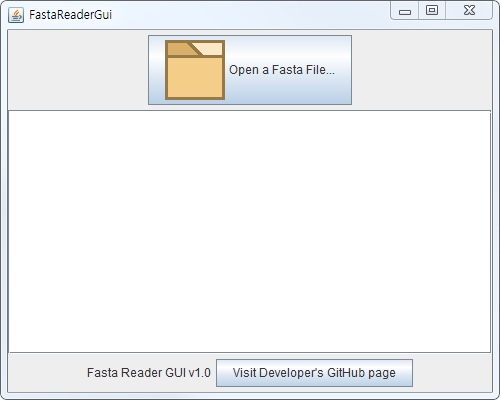
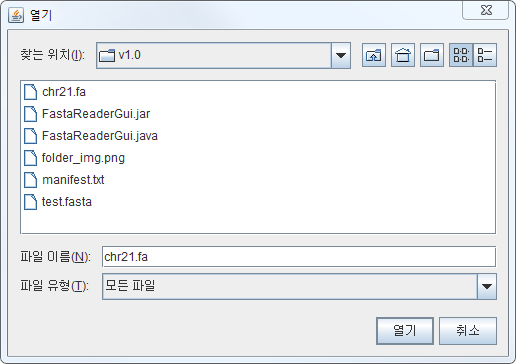
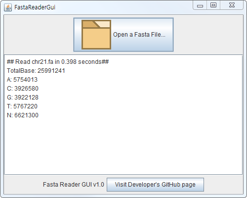
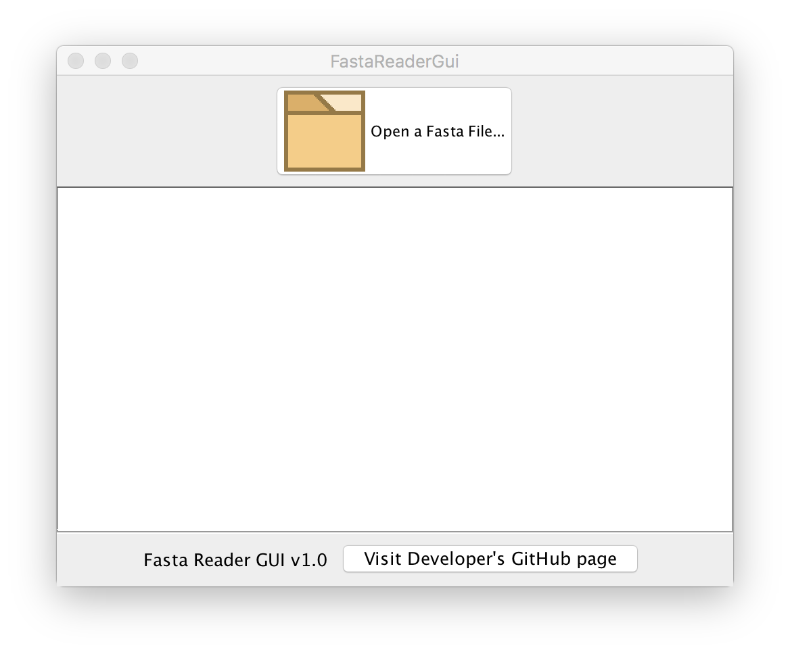
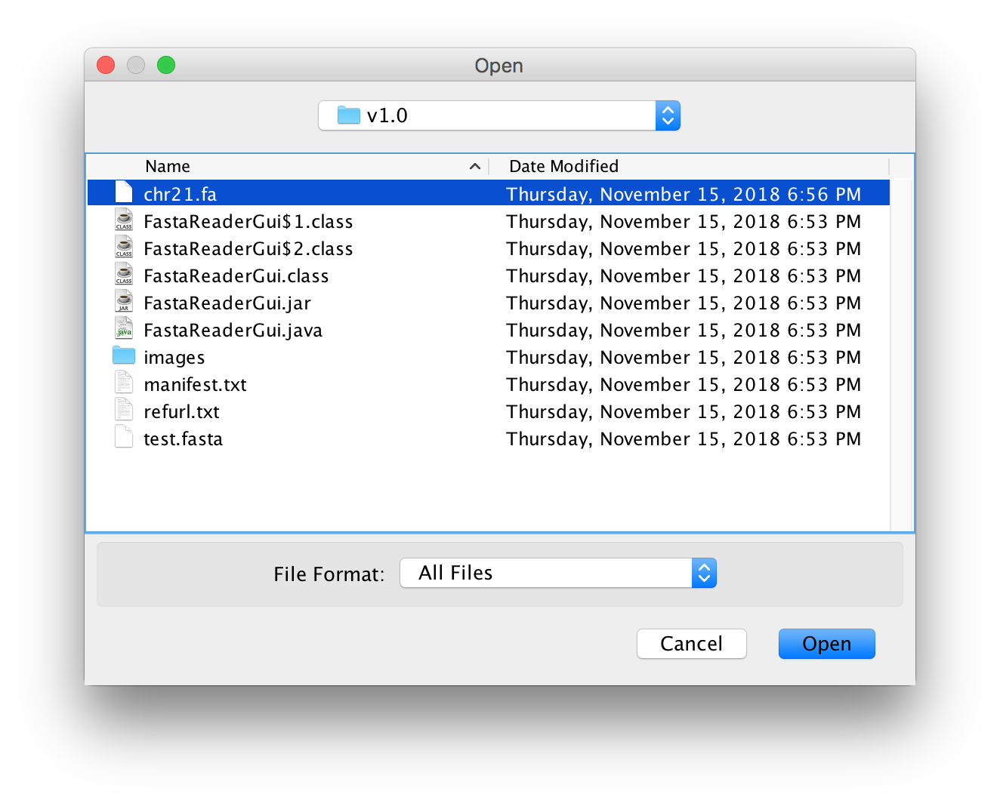
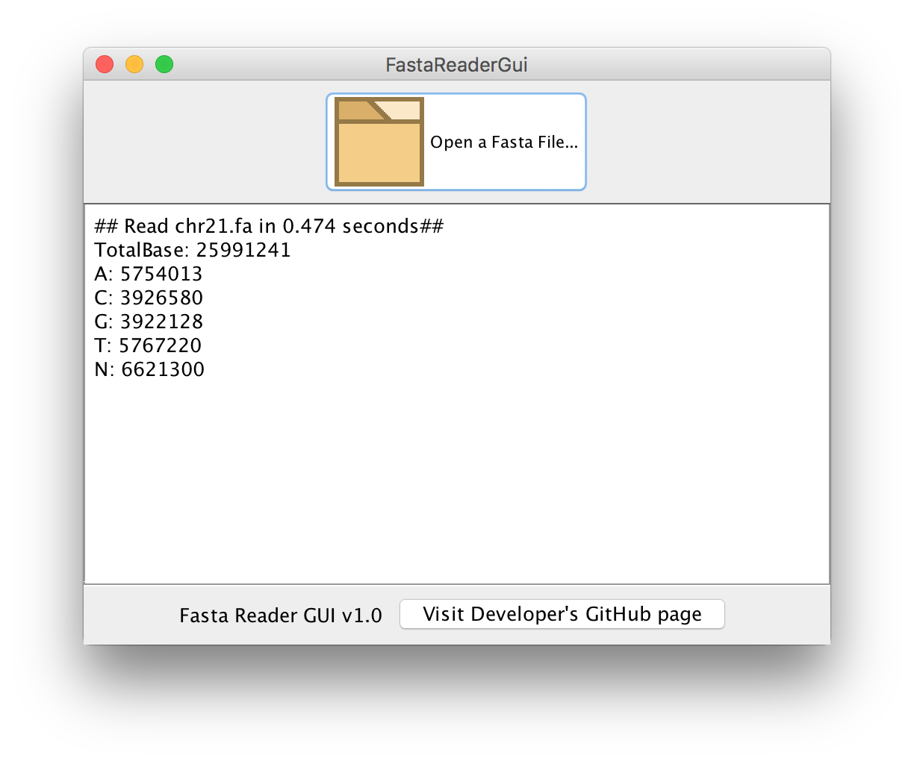

# FastaReader GUI Version

### 1. FastaReader GUI
* This program counts nucleotide bases including A, C, G, T and N from local FASTA file.
* This program requires Java 8.

### 2. Usage
* Click "Open a Fasta File..." Button
* Select fasta file to read

### 3. Screenshots
#### 3.1 PC

#### 3.2 MAC

